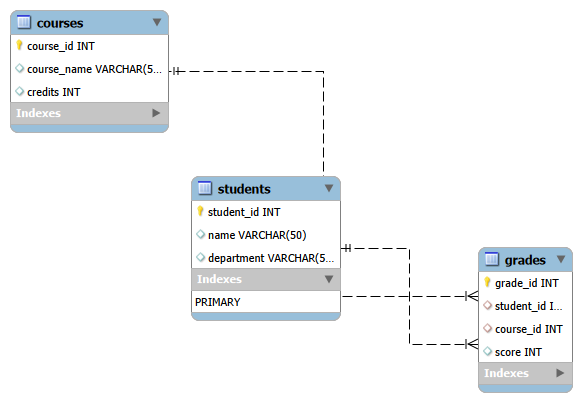

# database_programming_assignment1_-studentID-_Ayman
Student Information system using SQL
# Student Information System

## 📘 Description
This project is a **Student Information System** built using **MySQL**.  
It demonstrates database design, relationships, and SQL queries for managing student data.

## 🧩 ER Diagram


## 🧠 Features
- Create and manage student records  
- Store course and grade information  
- Use **JOIN** and **Window Functions** for analysis  

## 🧪 Example Query
```sql
SELECT student_id, score,
       NTILE(4) OVER (ORDER BY score DESC) AS performance_group
FROM students;
## 🧩 ER Diagram


## 📂 Files Included
- `StudentSystem_Model.mwb` → Database model  
- `StudentSystem_ERDiagram.png` → ER Diagram image  
- `student_system_queries.sql` → SQL queries
​📊 Analysis and Findings
​Descriptive Analysis: The database successfully tracks academic data, providing a clear overview of student performance across different courses.
​Diagnostic Analysis: By using Window Functions like NTILE and RANK, we can easily identify performance gaps and categorize students into quartiles.
​Prescriptive Analysis: We suggest implementing automated alerts for students in lower performance groups to provide early academic support.
